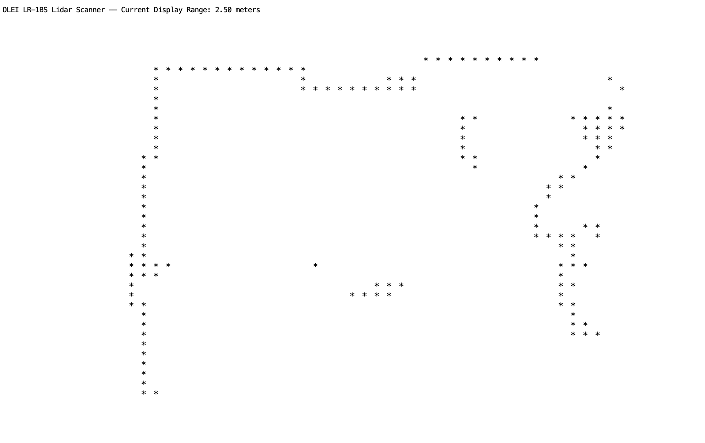

# From OLEI Documentation
| Offset | Length | Description |  
|--------|--------|-------------|
||| Definition of Frame Header |  
| 0 | 2 | ID, it is always 0xFAF0 |  
| 2 | 2 | Protocol version, the current code is 0x0200 |  
| 4 | 1 | Distance Scale, distance = readout data * distance scale |  
| 5 | 1 | Error status, 0 means OK, a corresponding pit pf "1" indicates an error.   BIT0: Monitor Fault, BIT1: Abnormal voltage, BIT2: Temperature Fault |
| 6 | 1 | Starting angle, resolution 1 |  
| 7 | 1 | End angle (not included), resolution 1|  
| 8 | 2 | The number of angles, representing the number of angles between the starting angle and the ending angle, that is the number of blocked in this packet |  
| 10 | 2 | Bit[14:0]: Rotation Rate   Bit15: Rotation Direction (0: clockwise, 1: counter-clockwise)|  
| 12 | 4 | Time stamp: unit ms. Indicates the number of milliseconds after power-on |  
| 16 | 4 | Checksum. For the CRC32 checksum of block data (except Frame header), the calculation polynomial is 0x04C11DB7. |  
||| Data block definition |  
| 0 | 2 | Distance Readout data, unsigned integer, indicating that the distance is determined by "readout data * distance scale" |  
| 2 | 1 | Signal Strength, indicated the strength of the redieved signal, range 0-255 |  
  
-------  
# What was found
## Data for a single sweep spans multiple packets
| Offset | Length | Description |  
|--------|--------|-------------|
||| Definition of Frame Header |
| 0 | 2 | 0x010f ? |
| 2 | 2 | 0xFEF0 A different ID from 0xFAF0 perhaps? |
| 4 | 2 | 0x0200 Protocol version? |  
| 6 | 1 | Distance Scale? |
| 7 | 10 | OLELR-1BS5 Identifier String?|
| 17 | 23 | The rest of the 40 byte header |
||| Data block definition |  
| 0 | 2 | Angle 0-360 in .25 degree increments. Data is sent from 0-360 and even more, even though range is +/- 135. |  
| 2 | 2 | Distance mm for the corresponding angle |  
| 4 | 2 | Signal Strenth (just a guess) |  
| 6 | 2 | 0x0000 Unused? |  
| 7 | n | Data Blocks 
